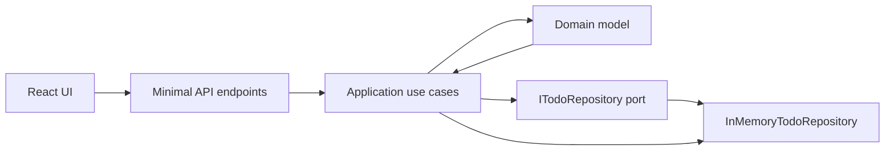

# Todo API Contract

This document is frontend/backend handshake source of truth for Todo behavior after design review.

## Domain Model

### Todo Entity

`Todo` is persisted and returned through the API as:

| Field | Type | Rules |
| --- | --- | --- |
| `id` | UUID | Generated by application when creating a todo. Stable identity. |
| `title` | string | Required. Must contain non-whitespace text. Can be changed. |
| `completed` | boolean | Defaults to `false`. Toggled by completed endpoint only. |
| `createdAt` | ISO-8601 date-time | Set to current UTC time at creation. Immutable. |

Invariants:

- Title cannot be null, empty, or whitespace.
- New todos start incomplete.
- Completion changes by toggling current value.
- Updating title preserves `id`, `completed`, and `createdAt`.
- Deleting a missing todo is idempotent at repository/use-case boundary.

### Repository Port

Application use cases depend on `ITodoRepository`:

```csharp
void Add(Todo todo);
Todo? GetById(Guid id);
IReadOnlyList<Todo> GetAll();
void Update(Todo todo);
void Delete(Guid id);
void DeleteByIds(IEnumerable<Guid> ids);
```

The port owns persistence operations only. Domain rules stay on `Todo`; orchestration stays in application use cases.

## REST API

Base URL in frontend dev: `http://localhost:5000`.

Common response shape:

```json
{
  "id": "11111111-1111-1111-1111-111111111111",
  "title": "Write docs",
  "completed": false,
  "createdAt": "2026-05-14T10:30:00Z"
}
```

### `POST /todos`

Creates one todo.

Request:

```json
{
  "title": "Write API contract"
}
```

Responses:

- `201 Created` with `TodoResponse` body and `Location: /todos/{id}`.
- `400 Bad Request` when `title` is null, empty, or whitespace.

### `GET /todos`

Lists todos, optionally filtered.

Query params:

| Name | Type | Required | Behavior |
| --- | --- | --- | --- |
| `completed` | boolean | No | When present, returns only todos matching completed state. |
| `search` | string | No | When present, returns todos whose title contains search text. |

Response:

- `200 OK` with array of `TodoResponse`.

Example:

```http
GET /todos?completed=true&search=docs
```

### `PUT /todos/{id}/title`

Replaces todo title.

Request:

```json
{
  "title": "Ship API contract"
}
```

Responses:

- `200 OK` with updated `TodoResponse`.
- `400 Bad Request` when `title` is null, empty, or whitespace.
- `404 Not Found` when todo does not exist.

### `PUT /todos/{id}/toggle`

Toggles completed state.

Responses:

- `200 OK` with updated `TodoResponse`.
- `404 Not Found` when todo does not exist.

### `DELETE /todos/{id}`

Deletes one todo.

Responses:

- `204 No Content`.

Deleting a missing id still returns `204 No Content`.

### `DELETE /todos?ids={id1},{id2}`

Deletes multiple todos by comma-separated UUIDs.

Example:

```http
DELETE /todos?ids=11111111-1111-1111-1111-111111111111,22222222-2222-2222-2222-222222222222
```

Responses:

- `204 No Content` when at least one valid UUID is provided.
- `400 Bad Request` when no valid UUIDs are provided.

Invalid UUID entries are ignored. If every entry is invalid or blank, request fails with `400`.

## Error Handling

Application-level todo errors use:

```json
{
  "statusCode": 400,
  "message": "Title cannot be empty or null"
}
```

Known status codes:

| Status | Cause | Shape |
| --- | --- | --- |
| `400` | Invalid title or bulk delete has no valid ids | `ErrorResponse` |
| `404` | Todo update/toggle target not found | `ErrorResponse` |
| `404` | Unknown route | `{ "error": "Not found" }` |
| `500` | Unhandled exception | `{ "error": "<message>" }` |

Frontend should treat any non-2xx response as failed request and preserve prior UI state unless later UX work defines recovery behavior.

## Testing Strategy

Current coverage gates:

| Layer | Tests | Behavior covered |
| --- | --- | --- |
| Domain | `BackendApi.Tests/Domain/TodoTests.cs` | Todo construction, title invariant, toggle, title update, immutable identity/time behavior. |
| Application use cases | `BackendApi.Tests/Application/UseCases/*Tests.cs` | Create, list filters, update title, toggle, delete, bulk delete. |
| Application facade | `BackendApi.Tests/Application/TodoApplicationServiceTests.cs` | Service methods coordinate use cases through public service API. |
| Infrastructure | `BackendApi.Tests/Infrastructure/InMemoryTodoRepositoryTests.cs` | Add, get, list, update, delete, bulk delete persistence behavior. |
| Backend API integration | `BackendApi.Tests/TodoApiIntegrationTests.cs` | HTTP lifecycle, endpoint status codes, JSON response state. |
| General API integration | `BackendApi.Tests/ApiIntegrationTests.cs` | Health, fallback 404, unhandled exception format. |
| Frontend context/components | `frontend/src/**/*.test.jsx` | Fetch contract usage, context state transitions, component behavior. |
| Frontend e2e | `frontend/e2e/todo-flow.spec.js` | User flow across create, search, filter, toggle, delete, bulk delete. |
| Docs contract | `BackendApi.Tests/DocsContractTests.cs` | This review-gate doc exists and covers required handshake topics. |

Test commands:

```powershell
dotnet test
npm test --prefix frontend
npm run test:e2e --prefix frontend
```

## Architecture



Dependency rule:

- Frontend depends on REST API contract.
- API layer depends on application service and DTO mapping.
- Application depends on domain model and repository port.
- Infrastructure implements repository port.
- Domain has no dependency on API, application, or infrastructure.

## Design Review

Design review completed for current implementation scope:

- Public todo API uses resource path `/todos` plus focused command paths for title update and completion toggle.
- Error responses are documented as currently implemented; future API-wide error shape changes are breaking.
- Repository remains in-memory for this implementation; persistence backend can change behind `ITodoRepository`.
- No breaking API or domain-model changes after this point without updating this document, tests, and frontend contract together.
